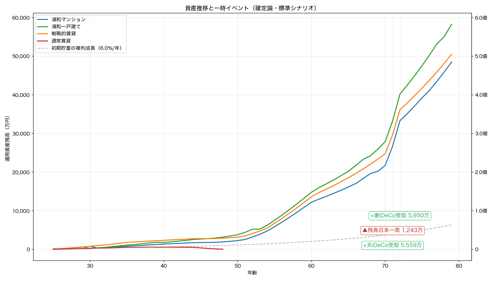
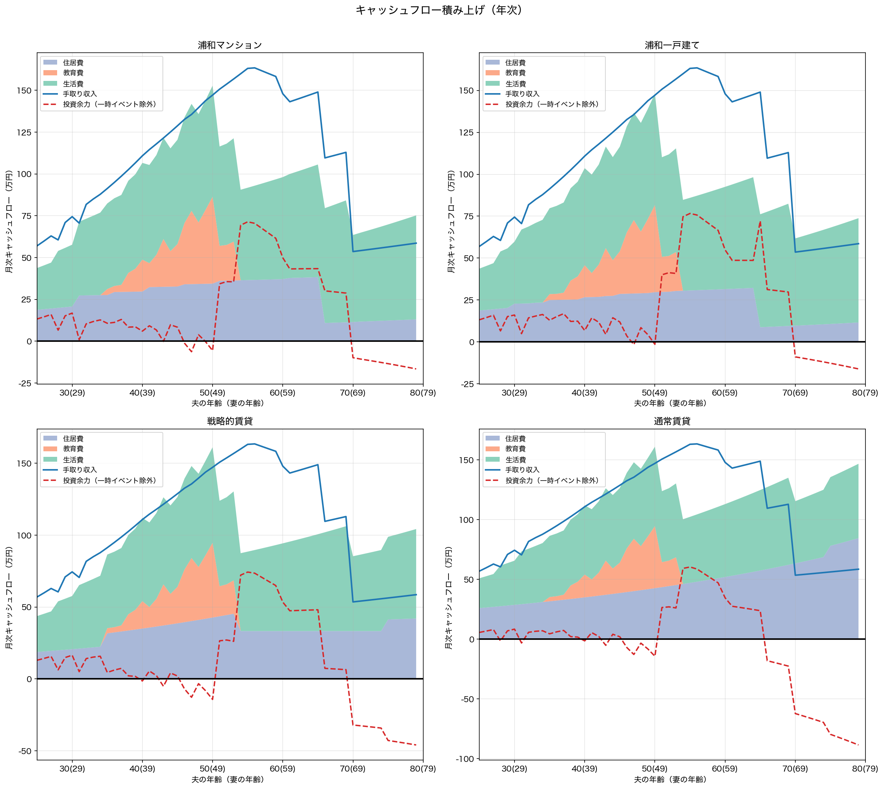
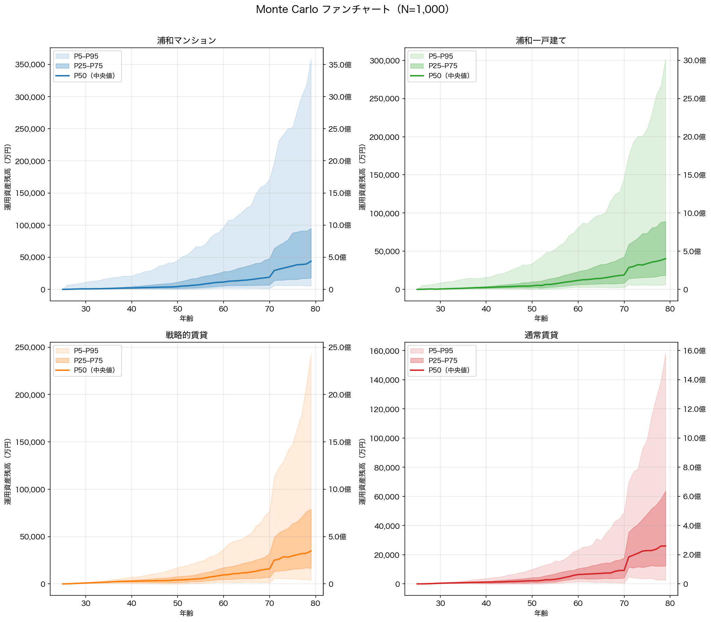

## 25歳始動・80歳完結：確率分布に基づく住宅戦略の55年間総合分析

---

## 第1章：前提条件

### 1.1 マクロ経済指標（5シナリオ）

日銀の2%物価目標が長期定着する想定のもと、**5シナリオ**を確定論ベースラインとし、標準シナリオ中心にモンテカルロ確率分析（N=1,000）で市場変動リスクを定量化する。

| パラメータ | 低成長 | 標準 | 高成長 | 慢性スタグフレーション | サイクル型(*) |
|----------|--------|------|--------|------------------|-----------|
| インフレ率 | 1.0% | **2.0%** | 3.0% | 2.0% | 2.3% |
| 賃金上昇率 | 1.0% | **2.0%** | 3.0% | 1.5% | 1.7% |
| 運用利回り | 5.0% | **6.0%** | 7.5% | 4.5% | 5.1% |
| 土地上昇率 | 0.0% | **0.8%** | 1.5% | 0.0% | 0.2% |
| 実質賃金 | ±0% | **±0%** | ±0% | **-0.5%** | **-0.6%** |
| 住宅ローン金利 | 0.50%→1.25% | **0.75%→2.50%** | 1.25%→3.50% | 0.75%→2.25% | 0.90%→2.75% |

(*) **サイクル型**は10年周期（7年通常＋3年スタグフレーション）で全パラメータが年次変動する。通常期は投資リターン6.0%・インフレ2.0%・賃金2.0%・土地0.75%、スタグフレーション期は投資リターン3.0%・インフレ3.0%・賃金1.0%・土地-1.0%。表中の値は加重平均。 55年間で5.5サイクルを経験。

**標準シナリオの根拠：** インフレ2.0%（日銀目標、CPI定着）、賃金2.0%（**実質横ばい**、キャリアカーブとは別の底上げ）、ローン0.75%→2.50%（5年ステップ）、運用6.0%（全世界株式の長期名目期待リターン上位、実質4.0%）、土地0.75%（実需エリアの緩やかな上昇）。

**慢性スタグフレーション：** インフレ2.0%に対し賃金1.5%で**実質賃金が毎年-0.5%低下**（55年で購買力76%）。運用4.5%、ローン0.75%→2.25%。

**サイクル型：** 好況と不況が10年周期で交互に訪れる現実的な経済変動モデル。スタグフレーション期には投資リターンが半減（6%→3%）し、インフレが加速（2%→3%）する一方で賃金は半減（2%→1%）。

### 1.2 世帯プロファイル

**世帯条件：** 夫25歳・妻24歳の共働き、貯蓄250万円、手取り月57万円（夫34万＋妻23万）、子2人（妻27歳出産, 妻30歳出産、**学部卒・22歳独立**）。生活費上乗せ月3万円。教育方針は高校から私立・理系。特別支出として飛鳥日本一周（71歳・500万円）を計上。

> **⚠ パラメータに関する注記：**
> - **現時点の世帯手取り月57万円（年684万）はコアターゲット（世帯年収1,000〜2,000万）を下回るが、キャリアカーブで中年期には大幅に上昇する。**一方で55年間の投資期間は最大の武器であり、初期の低収入を複利効果が長期で補う構造。ローン審査は開始時点で厳しいため、購入戦略では数年の待機が必要。

**所得の推移：**

5段階キャリアカーブ（賃金構造基本統計調査ベース）×名目賃金上昇率（年2.0%）。

| 年齢 | 夫(万/月) | 妻(万/月) | 世帯合計 | 備考 |
|------|----------|----------|---------|------|
| 25歳 | 34.0 | 23.0 | 57.0 | 開始 |
| 30歳 | 43.5 | 29.4 | 74.5 |  |
| 35歳 | 53.0 | 36.2 | 91.3 |  |
| 40歳 | 64.7 | 44.2 | 110.8 |  |
| 45歳 | 75.0 | 51.8 | 128.8 |  |
| 50歳 | 87.1 | 60.1 | 147.1 |  |
| 55歳 | 96.1 | 67.0 | 163.1 | 夫ピーク近辺 |
| 60歳 | 54.7 | 65.5 | 120.2 | 再雇用期 |
| 65歳 | 57.5 | 40.5 | 98.0 | 再雇用期 |
| 70歳 | 26.5 | 42.5 | 69.0 | 年金期 |
| 75歳 | 27.9 | 25.4 | 53.3 | 年金期 |
| 79歳 | 29.0 | 26.4 | 55.4 | 年金期 |

妻が1歳若いため、**夫60歳の再雇用後も妻の現役収入が1年間残る**。

**教育費：**

子2人・高校から私立・理系・学部。

**特別支出：**

| 年齢 | 内容 | 基準値 | インフレ調整後（名目） |
|------|------|--------|-------------------|
| 71歳 | 飛鳥日本一周 | 500万円 | 約1,243万円 |

### 1.3 生活防衛資金

**生活費6ヶ月分を現金確保。** 25歳時点で約150万円（初期資産の約60%）。世帯構成とインフレに連動。

### 1.4 iDeCo（個人型確定拠出年金）

夫婦各月2万円（計4万）を60歳まで拠出（全額所得控除）。**71歳で一時金受取**（退職所得控除を別枠適用）。夫は35年間（840万円）、妻は36年間（864万円）で**拠出累計1704万円**、税軽減累計約341万円、受取時退職所得税約1569万円。

### 1.5 4戦略の定義と初期コスト

浦和常盤・北浦和エリアの中古物件（マンション7,580万・築10年、一戸建て6,547万・築7年）。**浦和マンションは31歳で購入可能**、**浦和一戸建ては30歳で購入可能**。

| 項目 | **浦和マンション** | **浦和一戸建て** | **戦略的賃貸** | **通常賃貸** |
| :--- | :--- | :--- | :--- | :--- |
| 物件価格 | 7,580万円（築10年） | 6,547万円（築7年） | - | - |
| 住宅ローン（フルローン） | 7,580万円 | 6,547万円 | - | - |
| 購入時期 | **31歳** | **30歳** | - | - |
| 諸費用（物件価格の8%） | **606万円** | **524万円** | **105万円**（敷金等） | **105万円**（敷金等） |
| 生活防衛資金 | **150万円** | **150万円** | **150万円** | **150万円** |
| **25歳時の運用開始元本** | **0万円** | **0万円** | **0万円** | **0万円** |

---

## 第2章：戦略の仕組み

### 2.1 浦和マンション：駅近の利便性と高齢期のQOL

7,580万円（築10年、駅徒歩5-8分）。**31歳で購入**（25〜30歳は2LDK賃貸）。一戸建てとの価格差1,033万に加え、管理費・修繕積立金の段階増額で総コスト差はさらに拡大。

**月次コスト構造（管理費＋修繕積立金＋税＋保険）：**

| 築年数 | 管理費 | 修繕積立金 | 固定資産税 | 保険 | **月額合計** |
| :--- | :--- | :--- | :--- | :--- | :--- |
| 築10年（購入時） | 1.55万 | 1.1万（×1.0） | 1.8万 | 0.15万 | **4.6万** |
| 築30年 | 1.55万 | 2.2万（×2.0） | 1.8万 | 0.15万 | **5.7万** |
| 築50年超 | 1.55万 | 4.0万（×3.6） | 1.8万 | 0.15万 | **7.5万** |

※管理費等にインフレ2.0%累積。修繕積立金は長期修繕計画の名目値（追加調整なし）。

**高齢期のQOL：** ワンフロア・オートロック・共用部管理が利点。ただし80歳時点で築65年、建替え問題が顕在化。

### 2.2 浦和一戸建て：支出固定化と実物資産の保持

完済後（70歳）の月次コスト4.4万/月はマンションより低い。

| 築年数 | 小修繕 | 固定資産税 | 保険 | その他(※) | **月額合計** |
| :--- | :--- | :--- | :--- | :--- | :--- |
| 築7-10年（購入時） | 1.0万 | 1.8万 | 0.4万 | 0.7万 | **3.9万** |
| 築20年 | 1.3万 | 1.8万 | 0.4万 | 0.7万 | **4.2万** |
| 築30年 | 1.6万 | 1.8万 | 0.4万 | 0.7万 | **4.5万** |
| 築40年超 | 1.8万 | 1.8万 | 0.4万 | 0.7万 | **4.7万** |
| 完済後 | 1.5万 | 1.8万 | 0.4万 | 0.7万 | **4.4万** |

※その他：セキュリティ0.5万＋雑費0.2万。全額インフレ2.0%累積。

80歳時点で**築62年**。水道光熱費は月0.3万追加（インフレ連動）。

### 2.3 戦略的賃貸：ノマド・ダウンサイジング

- **Phase I：2LDK（家賃18万）** — 25〜34歳。
- **Phase II：3LDK（25万）** — 35〜53歳。教育費との二重負担が**18年間**。
- **Phase III：2LDK** — 54〜80歳。入居時の名目家賃で固定。

**75歳以降の入居審査リスク：** 確率加重プレミアム月3万円（インフレ連動）。

**通常賃貸（3LDK固定）：** 全期間3LDK（月25万）。家賃はインフレ上昇し続ける。

### 2.4 ペアローン必須の構造的制約

- **離婚リスク：** 共有名義で財産分与が複雑（賃貸は契約解除のみ）
- **片働きリスク：** 片方の収入停止で住宅費を単独負担→破綻リスク
- **団信：** 片方死亡でその債務のみ免除、もう片方は残存

---

## 第3章：確定論ベースライン — 「計画通りの場合」

**年利6.0%が55年間一定の上限推計。** 確率分析は第4章。

### 3.1 5シナリオ×4戦略の最終結果

| シナリオ | マンション | 一戸建て | 戦略的賃貸 | 通常賃貸 |
|----------|----------|---------|------|------------|
| **低成長** | 3.26億 | **3.99億** | 3.32億 | 1.42億 |
| **標準** | 5.28億 | **6.34億** | 5.18億 | 1.72億 |
| **高成長** | 10.02億 | **11.99億** | 10.30億 | 2.98億 |
| **慢性スタグフレーション** | ⚠48歳破綻 | **1.62億** | ⚠49歳破綻 | ⚠40歳破綻 |
| **サイクル型** | ⚠49歳破綻 | **2.08億** | ⚠50歳破綻 | ⚠42歳破綻 |

※80歳時点の税引後名目値。インフレ55年で貨幣価値は約34%に縮小（標準・浦和一戸建て6.34億→**実質約2.13億**）。

### 3.2 資産推移とキャッシュフロー構造

**チャートの読み方：** 上段=4戦略の資産推移（赤▲=一時支出、緑+=iDeCo受取）。下段=個別キャッシュフロー（積み上げ=支出内訳、青線=収入、赤破線=投資余力）。

**主要転換点：**

- **蓄積期（25〜34歳）：** 教育費前の投資蓄積期。
- **教育費期（〜53歳）：** 子2人の教育費が発生。
- **特別支出（71歳）：** 飛鳥日本一周500万円（名目約1,243万円）。
- **段階的再雇用（夫60歳・妻61歳）：** 1歳差が収入急減を2段階に分散。
- **ローン完済（70歳）：** 住居費が激減。残り10年で序列確定。
- **年金期（70〜80歳）：** 75歳以降、賃貸に高齢者プレミアム月3万が加算。

### 3.3 標準シナリオの詳細内訳

| 項目 | **浦和マンション** | **浦和一戸建て** | **戦略的賃貸** |
| :--- | :--- | :--- | :--- |
| **運用資産残高(80歳)** | 52,458万円 | 62,765万円 | 54,043万円 |
| **不動産土地価値(名目)** | 3,023万円 | 5,586万円 | 0 |
| **不動産換金コスト** | -200万円 | -650万円 | 0 |
| **流動性ディスカウント** | 0 | -838万円 | 0 |
| **最終純資産（税引前）** | **55,281万円（5.53億円）** | **66,863万円（6.69億円）** | **54,043万円（5.40億円）** |
| **金融所得税** | -2,515万円 | -3,449万円 | -2,221万円 |
| **税引後手取り純資産** | **52,766万円（5.28億円）** | **63,414万円（6.34億円）** | **51,822万円（5.18億円）** |

**通常賃貸：** 運用資産17,318万円、金融所得税▲128万円、税引後17,190万円（1.72億円）。

**NISA・特定口座の内訳：**

| 戦略 | NISA残高（元本） | 特定口座残高（元本） | 金融所得税 |
|------|-----------------|------------------|----------|
| 浦和マンション | 28,784万円（元本3,600万円） | 23,349万円（元本10,970万円） | 2,515万円 |
| 浦和一戸建て | 32,824万円（元本3,600万円） | 29,615万円（元本12,639万円） | 3,449万円 |
| 戦略的賃貸 | 33,612万円（元本3,600万円） | 20,106万円（元本9,174万円） | 2,221万円 |
| 通常賃貸 | 15,373万円（元本3,600万円） | 1,620万円（元本991万円） | 128万円 |

### 3.4 感度分析：投資規律（ライフスタイル・クリープ）

100%投資は非現実的。ローンの「強制貯蓄」効果の有無で規律が分かれる。

- **購入派：余剰資金の90%を投資**（ローンの強制貯蓄効果）
- **賃貸派：余剰資金の80%を投資**（クリープ発生しやすい）

| シナリオ | マンション | 一戸建て | 戦略的賃貸 | 通常賃貸 |
|----------|----------|---------|------|------|
| **低成長** | 2.85億(▲0.41) | 3.51億(▲0.48) | 2.57億(▲0.76) | 0.91億(▲0.51) |
| **標準** | 4.60億(▲0.68) | 5.56億(▲0.78) | 3.95億(▲1.23) | 0.89億(▲0.83) |
| **高成長** | 8.68億(▲1.34) | 10.42億(▲1.57) | 7.83億(▲2.47) | 1.35億(▲1.62) |
| **慢性スタグフレーション** | ⚠47歳破綻(+0.00) | ⚠53歳破綻 | ⚠47歳破綻(+0.00) | ⚠40歳破綻(+0.00) |
| **サイクル型** | ⚠48歳破綻(+0.00) | 1.65億(▲0.43) | ⚠48歳破綻(+0.00) | ⚠40歳破綻(+0.00) |

---

## 第4章：Monte Carlo 確率分析 — 市場変動の現実

1,000回試行のモンテカルロで**確率分布と破綻リスク**を定量化。

### 4.1 シミュレーション条件

| 変動要因 | 分布 | サンプリング | パラメータ |
|---------|------|------------|----------|
| 投資リターン | 対数正規分布 | **年次**（sequence risk 捕捉） | 期待値6.0%、標準偏差15% |
| インフレ率 | 正規分布 | ラン単位 | 平均2.0%、標準偏差0.5% |
| 賃金上昇率 | 正規分布 | ラン単位 | 平均2.0%、標準偏差0.5%、インフレとの相関0.8 |
| 土地上昇率 | 正規分布 | ラン単位 | 平均0.75%、標準偏差3% |
| インフレ-土地相関 | コレスキー分解 | ラン単位 | 相関係数0.6 |

**生活イベントリスク：**

| イベント | 確率 | 影響 | 適用対象 |
|---------|------|------|---------|
| 失業 | 年2%（最大2回） | 6ヶ月間収入ゼロ | 全戦略（60歳未満） |
| 災害 | 年0.5% | 物件価値30%毀損（保険50%カバー） | 購入派のみ |
| 介護 | 75歳以降年5% | 月15万円追加 | 全戦略 |
| 入居拒否 | 70歳以降年10% | 月5万円プレミアム | 賃貸のみ |
| 離婚 | 年1% | 資産50%分割＋物件売却＋2LDK賃貸化 | 全戦略 |
| 配偶者死亡 | 年0.1% | 団信消滅＋保険金3,000万＋遺族年金 | 全戦略 |

### 4.2 80歳時点の税引後手取り資産分布

| 戦略 | P5(悲観) | P25 | P50(中央値) | P75 | P95(楽観) | 破綻確率 |
|------|---------|-----|------------|-----|---------|---------|
| 浦和マンション | 0.00億 | 0.00億 | **2.66億** | 8.98億 | 35.58億 | 37.6% |
| 浦和一戸建て | 0.00億 | 0.00億 | **3.19億** | 9.43億 | 32.50億 | 35.8% |
| 戦略的賃貸 | 0.00億 | 0.00億 | **1.33億** | 5.54億 | 20.55億 | 41.6% |
| 通常賃貸 | 0.00億 | 0.00億 | **0.00億** | 0.34億 | 8.14億 | 74.0% |

| 戦略 | 平均 | 標準偏差 |
|------|------|---------|
| 浦和マンション | 8.50億 | 19.35億 |
| 浦和一戸建て | 8.38億 | 18.05億 |
| 戦略的賃貸 | 4.77億 | 9.76億 |
| 通常賃貸 | 1.52億 | 5.11億 |

### 4.3 確定論との乖離分析

| 戦略 | 確定論(6.0%固定) | MC P50 | 乖離率 |
|------|-----------------|--------|-------|
| 浦和マンション | 5.28億 | **2.66億** | **▲50%** |
| 浦和一戸建て | 6.34億 | **3.19億** | **▲50%** |
| 戦略的賃貸 | 5.18億 | **1.33億** | **▲74%** |
| 通常賃貸 | 1.72億 | **0.00億** | **▲100%** |

### 4.4 ストレステスト：イベントリスクの影響

| イベント | 浦和マンション | 浦和一戸建て | 戦略的賃貸 | 通常賃貸 |
|---------|-------------|------------|----------|--------|
| ベース(イベントなし) | 9.7% | 6.5% | 9.1% | 44.1% |
| 失業6ヶ月(年2%) | 26.6% | 21.1% | 17.3% | 57.5% |
| 離婚(年1%) | 29.6% | 25.5% | 28.9% | 58.0% |
| 全イベント | 37.6% | 35.8% | 41.6% | 74.0% |

---

## 第5章：数値に現れない各戦略の特性

**購入派：** 居住安定性（更新拒否・値上げなし）、自由な改修、完済後の低コスト。子2人の教育費期間中も住居費が固定されるため、見通しが立ちやすい。

**賃貸派：** 環境変更の柔軟性（転居容易）、災害・地域衰退リスクからの移動性、住環境の更新。ダウンサイズで再雇用開始後に支出を正常化可能。

**共通：** 維持管理の時間コスト（55年間で一戸建て約1760h、マンション約935h、賃貸約605h）。

---

## 第6章：出口戦略 — 「80歳で老人ホーム」の前提

### 6.1 物理的・身体的限界

80歳時点で一戸建て築62年、マンション築65年。階段転倒・ヒートショック（戸建て）、老朽化（マンション）が課題。

### 6.2 子供に対する負担の排除

自宅居住継続は「介護」「家財整理・解体・売却」の負担を子供に転嫁するリスク。

### 6.3 各戦略の出口手続きと税務

- **購入派：** 不動産売却＋証券で入居。3,000万特別控除で譲渡税ゼロ
- **賃貸派：** 証券のみで入居。不動産処分不要でシンプル

### 6.4 入居可能な施設グレード

80歳時点の税引後純資産から、夫婦で入居できる有料老人ホームの水準を試算する。

**前提条件：**
- 80歳で夫婦2人入居（2LDK・約65〜75㎡）、110歳まで生存（30年間・長生きリスク対応）
- 入居審査ベース：運用利回り0%（施設側はキャッシュカバレッジで審査、暴落リスク考慮）
- 基本月額（管理費・サービス費）は30年間定額、追加実費は年齢逓減（80代100%→90代60%→100代30%）
- 施設費用・残存資産とも2026年価値ベース（インフレ相殺済み）

| グレード | 入居一時金 | 基本月額 | 追加実費(80代) | 必要資産 | 実例施設 |
|---------|-----------|---------|--------------|---------|---------|
| S（超高級） | 2億円 | 50万円 | 40万円 | **4.71億円** | パークウェルステイト西麻布 |
| A（高級） | 1.5億円 | 30万円 | 30万円 | **3.26億円** | サクラビア成城、サンシティ銀座EAST |
| B（準高級） | 7,000万円 | 35万円 | 15万円 | **2.30億円** | グランクレール成城、トラストガーデン用賀の杜 |
| C（標準） | 1,000万円 | 20万円 | 10万円 | **1.05億円** | 介護付き有料老人ホーム |

シミュレーション出力は80歳時点の名目値。2.0%インフレ×55年で割り引き、2026年実質値に変換（係数0.34）。

| 戦略 | 確定論（実質） | グレード | MC P50（実質） | グレード | MC P25（実質） | グレード |
|------|-------------|---------|-------------|---------|-------------|---------|
| 浦和マンション | 1.78億 | **C** | 0.89億 | - | 0.00億 | - |
| 浦和一戸建て | 2.13億 | **C** | 1.07億 | C | 0.00億 | - |
| 戦略的賃貸 | 1.74億 | **C** | 0.45億 | - | 0.00億 | - |
| 通常賃貸 | 0.58億 | **-** | 0.00億 | - | 0.00億 | - |

---

## 第7章：結論

### 7.1 総合比較表

| 評価軸 | 一戸建て | マンション | 戦略的賃貸 | 通常賃貸 |
|--------|---------|-----------|-----------|---------|
| **確定論・標準シナリオ** | **6.34億** | 5.28億 | 5.18億 | 1.72億 |
| **確定論・投資規律込み** | **5.56億** | 4.60億 | 3.95億 | 0.89億 |
| **MC・P50（中央値）** | **3.19億** | 2.66億 | 1.33億 | 0.00億 |
| **MC・P5（悲観）** | 0.00億 | 0.00億 | 0.00億 | 0.00億 |
| **MC・破綻確率** | **35.8%** | 37.6% | 41.6% | 74.0% |
| 確定論・低成長 | ✅（3.99億） | ✅（3.26億） | ✅（3.32億） | ✅（1.42億） |
| 確定論・高成長 | ✅（11.99億） | ✅（10.02億） | ✅（10.30億） | ✅（2.98億） |
| 確定論・慢性スタグフレーション | ✅（1.62億） | ⚠48歳破綻 | ⚠49歳破綻 | ⚠40歳破綻 |
| 確定論・サイクル型 | ✅（2.08億） | ⚠49歳破綻 | ⚠50歳破綻 | ⚠42歳破綻 |

### 7.2 構造的結論

**浦和一戸建てが圧倒的に有利**（最大4.6億・73%差）。戦略選択が資産形成の成否を左右する。

**浦和一戸建てがリターン・安全性の両面で優位。**MC中央値3.19億、破綻確率35.8%。

**⚠ 全戦略で破綻確率が極めて高い（最善: 浦和一戸建て 35.8%）。**現在の前提では多くのシナリオで80歳前に資産が枯渇する。**シミュレーション以前に前提の再設計が必要：** 初期資産の大幅な積み増し、生活水準の根本的な見直し、教育費プランの変更、住宅購入の断念など抜本的な対策を講じなければ安定した資産形成は困難。

**あなたの設定に基づく定性評価：**

- **子2人** → 教育費が重複する期間があり、購入戦略の住居費固定が家計の安定に寄与。通常賃貸は3LDK＋インフレで投資余力が構造的に圧迫される。
- **購入待機** → 浦和マンションは31歳、浦和一戸建ては30歳まで購入できない。待機中は賃貸で資産形成を開始でき、賃貸派は即時フルスタートの利点がある。

**投資規律の影響：** 戦略的賃貸は規律低下で1.2億の減少（全戦略中最大）。賃貸はローンの「強制貯蓄」がないため、支出管理の自己規律が試される。

**初期資産250万円：** 生活防衛資金を差し引くと投資元本はわずか。月次の投資余力の積み上げが資産形成のエンジンとなる。

**全5シナリオ生存：** 浦和一戸建て。慢性スタグフレーション・サイクル型で破綻する戦略は回避すべき。

**年齢差1歳：** 退職・再雇用の時期がわずかにずれるが、分散効果は限定的。

### 7.3 リスク認識

**投資継続が最大の前提。** 貯金のみではインフレで実質購買力が約34%に縮小。

**生活コスト管理が生死を分ける：** 日常の支出水準が最終資産に与える影響は住居選択以上に大きい。

**教育費リスク：** 教育費はインフレ調整前の基準値。子の進路変更は上振れ/下振れ要因。

**特別支出：** 合計500万円（2026年価値）が全戦略の資産を押し下げている。

**ペアローン：** 夫婦共働き継続が前提。離婚リスクはストレステスト定量化済み。