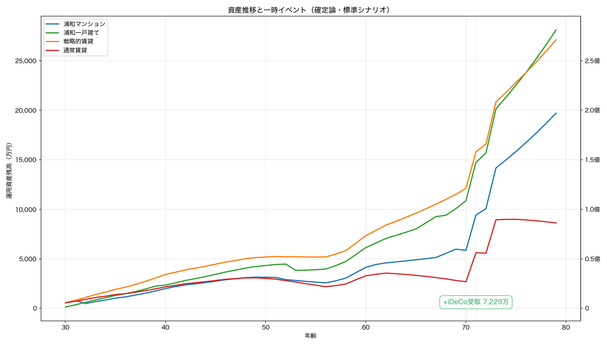
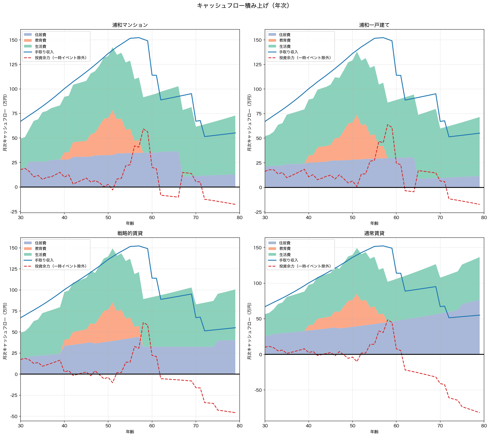
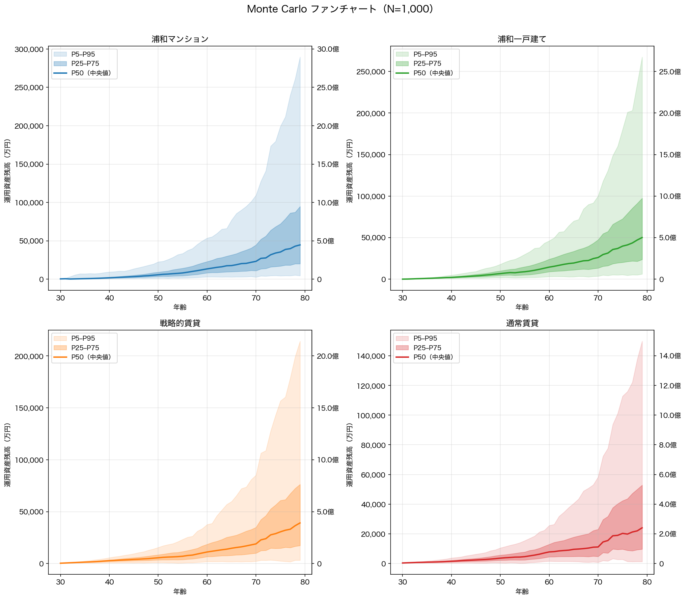

## 30歳始動・80歳完結：確率分布に基づく住宅戦略の50年間総合分析

---

## 第1章：前提条件

### 1.1 マクロ経済指標（5シナリオ）

日銀の2%物価目標が長期定着する想定のもと、**5シナリオ**を確定論ベースラインとし、標準シナリオ中心にモンテカルロ確率分析（N=1,000）で市場変動リスクを定量化する。

| パラメータ | 低成長 | 標準 | 高成長 | 慢性スタグフレーション | サイクル型(*) |
|----------|--------|------|--------|------------------|-----------|
| インフレ率 | 1.0% | **2.0%** | 3.0% | 2.0% | 2.3% |
| 賃金上昇率 | 1.0% | **2.0%** | 3.0% | 1.5% | 1.7% |
| 運用利回り | 5.0% | **6.0%** | 7.5% | 4.5% | 5.1% |
| 土地上昇率 | 0.0% | **0.8%** | 1.5% | 0.0% | 0.2% |
| 実質賃金 | ±0% | **±0%** | ±0% | **-0.5%** | **-0.6%** |
| 住宅ローン金利 | 0.50%→1.25% | **0.75%→2.50%** | 1.25%→3.50% | 0.75%→2.25% | 0.90%→2.75% |

(*) **サイクル型**は10年周期（7年通常＋3年スタグフレーション）で全パラメータが年次変動する。通常期は投資リターン6.0%・インフレ2.0%・賃金2.0%・土地0.75%、スタグフレーション期は投資リターン3.0%・インフレ3.0%・賃金1.0%・土地-1.0%。表中の値は加重平均。 50年間で5.0サイクルを経験。

**標準シナリオの根拠：** インフレ2.0%（日銀目標、CPI定着）、賃金2.0%（**実質横ばい**、キャリアカーブとは別の底上げ）、ローン0.75%→2.50%（5年ごとに段階引き上げ、5段階）、運用6.0%（全世界株式の長期名目期待リターン上位、実質4.0%）、土地0.75%（実需エリアの緩やかな上昇）。

**慢性スタグフレーション：** インフレ2.0%に対し賃金1.5%で**実質賃金が毎年-0.5%低下**（50年で購買力78%）。運用4.5%、ローン0.75%→2.25%。

**サイクル型：** 好況と不況が10年周期で交互に訪れる現実的な経済変動モデル。スタグフレーション期には投資リターンが半減（6%→3%）し、インフレが加速（2%→3%）する一方で賃金は半減（2%→1%）。

### 1.2 世帯プロファイル

**世帯条件：** 夫30歳・妻28歳の共働き、貯蓄600万円、手取り月67万円（夫40万＋妻27万）、子2人（妻31歳出産, 妻33歳出産、**学部卒・22歳独立**）。年齢別ベースライン生活費に上乗せ月3万円。教育方針は高校から私立・理系。特別支出として飛鳥日本一周（71歳・500万円）を計上。ペット1匹（夫32歳迎え入れ）。

**就労・年金：** 夫: 再雇用終了70歳・年金受給開始60歳（5年繰上げ、受給額-24.0%・月0.4%×60ヶ月）。60〜70歳は就労と年金が併給（在職老齢年金の対象）／妻: 再雇用終了65歳・年金受給開始60歳（5年繰上げ、受給額-24.0%・月0.4%×60ヶ月）。60〜65歳は就労と年金が併給（在職老齢年金の対象）。
繰上げにより受給額は-24.0%だが、早期に受け取った年金を年6%で運用することで繰下げの増額率（月+0.7%）を上回る複利効果が得られる。投資リターンが年2%を超える前提では、繰上げ受給+運用が繰下げ待機より有利になる（ただし投資しない場合は繰下げの方が得）。

**所得の推移：**

5段階キャリアカーブ（賃金構造基本統計調査ベース）×名目賃金上昇率（年2.0%）。

| 年齢(夫) | 夫(万/月) | 妻(万/月) | 世帯合計 | 備考 |
|------|----------|----------|---------|------|
| 30歳 | 40.0 | 27.0 | 67.0 | 開始 |
| 35歳 | 48.8 | 33.6 | 85.3 |  |
| 40歳 | 59.4 | 40.9 | 102.3 |  |
| 45歳 | 69.0 | 48.4 | 119.4 |  |
| 50歳 | 80.0 | 56.2 | 138.2 |  |
| 55歳 | 88.4 | 63.3 | 151.6 | 夫ピーク近辺 |
| 60歳 | 76.8 | 63.8 | 140.5 | 年金+再雇用 |
| 65歳 | 80.7 | 59.8 | 140.4 | 年金+再雇用 |
| 70歳 | 29.2 | 22.2 | 51.4 | 年金期 |
| 75歳 | 30.7 | 23.3 | 54.1 | 年金期 |
| 79歳 | 32.0 | 24.3 | 56.2 | 年金期 |

妻が2歳若いため、**夫60歳の再雇用後も妻の現役収入が2年間残る**。

**教育費：**

子2人・高校から私立・理系・学部。

**特別支出：**

| 年齢 | 内容 | 基準値 | インフレ調整後（名目） |
|------|------|--------|-------------------|
| 71歳 | 飛鳥日本一周 | 500万円 | 約1,126万円 |

### 1.3 生活防衛資金

**生活費6ヶ月分を現金確保。** 30歳時点で約171万円（初期資産の約28%）。世帯構成とインフレに連動。

### 1.4 iDeCo（個人型確定拠出年金）

夫婦各月2万円（計4万）を60歳まで拠出（全額所得控除）。**71歳で一時金受取**（退職所得控除を別枠適用）。夫は30年間（720万円）、妻は32年間（768万円）で**拠出累計1488万円**、税軽減累計約370万円、受取時退職所得税約832万円。

### 1.5 4戦略の定義と初期コスト

浦和常盤・北浦和エリアの中古物件（マンション7,580万・築10年、一戸建て6,547万・築7年）。**浦和マンションは32歳で購入可能**。

| 項目 | **浦和マンション** | **浦和一戸建て** | **戦略的賃貸** | **通常賃貸** |
| :--- | :--- | :--- | :--- | :--- |
| 物件価格 | 7,580万円（築10年） | 6,547万円（築7年） | - | - |
| 住宅ローン（フルローン） | 7,580万円 | 6,547万円 | - | - |
| 購入時期 | **32歳** | 30歳 | - | - |
| 諸費用（物件価格の8%） | **606万円** | **524万円** | **105万円**（敷金等） | **105万円**（敷金等） |
| 生活防衛資金 | **171万円** | **171万円** | **171万円** | **171万円** |
| **30歳時の運用開始元本** | **0万円** | **0万円** | **324万円** | **324万円** |

**投資口座：** NISA（夫婦合計上限3,600万円、非課税）→ 特定口座（課税20.315%）の順で運用。取り崩しは特定口座 → NISA → 生活防衛資金の逆順。

---

## 第2章：戦略の仕組み

### 2.1 浦和マンション：駅近の利便性と高齢期のQOL

7,580万円（築10年、駅徒歩5-8分）。**32歳で購入**（30〜31歳は2LDK賃貸）。一戸建てとの価格差1,033万に加え、管理費・修繕積立金の段階増額で総コスト差はさらに拡大。

**月次コスト構造（管理費＋修繕積立金＋税＋保険）：**

| 築年数 | 管理費 | 修繕積立金 | 固定資産税 | 保険 | **月額合計** |
| :--- | :--- | :--- | :--- | :--- | :--- |
| 築10年（購入時） | 1.55万 | 1.1万（×1.0） | 1.8万 | 0.15万 | **4.6万** |
| 築30年 | 1.55万 | 2.2万（×2.0） | 1.8万 | 0.15万 | **5.7万** |
| 築50年超 | 1.55万 | 4.0万（×3.6） | 1.8万 | 0.15万 | **7.5万** |

※管理費等にインフレ2.0%累積。修繕積立金は長期修繕計画の名目値（追加調整なし）。

**高齢期のQOL：** ワンフロア・オートロック・共用部管理が利点。ただし80歳時点で築58年、建替え問題が顕在化。

### 2.2 浦和一戸建て：支出固定化と実物資産の保持

完済後（65歳）の月次コスト4.4万/月はマンションより低い。

| 築年数 | 小修繕 | 固定資産税 | 保険 | その他(※) | **月額合計** |
| :--- | :--- | :--- | :--- | :--- | :--- |
| 築7-10年（購入時） | 1.0万 | 1.8万 | 0.4万 | 0.7万 | **3.9万** |
| 築20年 | 1.3万 | 1.8万 | 0.4万 | 0.7万 | **4.2万** |
| 築30年 | 1.6万 | 1.8万 | 0.4万 | 0.7万 | **4.5万** |
| 築40年超 | 1.8万 | 1.8万 | 0.4万 | 0.7万 | **4.7万** |
| 完済後 | 1.5万 | 1.8万 | 0.4万 | 0.7万 | **4.4万** |

※その他：セキュリティ0.5万＋雑費0.2万。全額インフレ2.0%累積。

80歳時点で**築57年**。水道光熱費は月0.3万追加（インフレ連動）。

### 2.3 戦略的賃貸：ノマド・ダウンサイジング

- **Phase I：2LDK（家賃18万）** — 30〜39歳。
- **Phase II：3LDK（25万）** — 40〜57歳。教育費との二重負担が**18年間**。
- **Phase III：2LDK** — 58〜80歳。入居時の名目家賃で固定。

**75歳以降の入居審査リスク：** 高齢者の入居拒否率（約30%）×追加家賃を期待値換算し、月3万円の確率加重プレミアムとして加算（インフレ連動）。

**通常賃貸（3LDK固定）：** 全期間3LDK（月25万）。家賃はインフレ上昇し続ける。

### 2.4 ペアローン必須の構造的制約

- **離婚リスク：** 共有名義で財産分与が複雑（賃貸は契約解除のみ）
- **片働きリスク：** 片方の収入停止で住宅費を単独負担→破綻リスク
- **団信：** 片方死亡でその債務のみ免除、もう片方は残存

---

## 第3章：確定論ベースライン — 「計画通りの場合」

**年利6.0%が50年間一定の上限推計。** 確率分析は第4章。

### 3.1 5シナリオ×4戦略の最終結果

| シナリオ | マンション | 一戸建て | 戦略的賃貸 | 通常賃貸 |
|----------|----------|---------|------|------------|
| **低成長** | 4.00億 | **4.71億** | 4.11億 | 2.71億 |
| **標準** | 6.26億 | **7.23億** | 6.28億 | 3.85億 |
| **高成長** | 11.23億 | **12.82億** | 11.75億 | 6.90億 |
| **慢性スタグフレーション** | 2.27億 | **2.83億** | 1.95億 | 0.25億 |
| **サイクル型** | 2.74億 | **3.38億** | 2.54億 | 0.45億 |

※80歳時点の税引後名目値。インフレ50年で貨幣価値は約37%に縮小（標準・浦和一戸建て7.23億→**実質約2.69億**）。

### 3.2 資産推移とキャッシュフロー構造

**チャートの読み方：** 上段=4戦略の**金融資産**推移（不動産を含まない。赤▲=一時支出 / 緑+=iDeCo受取）。購入派は80歳時点で不動産売却益が加算されるため、最終順位はチャートと異なりうる（§7参照）。下段=個別キャッシュフロー（積み上げ=支出内訳、青線=収入、赤破線=投資余力）。

**主要転換点：**

- **蓄積期（30〜39歳）：** 教育費前の投資蓄積期。
- **教育費期（〜57歳）：** 子2人の教育費が発生。
- **特別支出（71歳）：** 飛鳥日本一周500万円（名目約1,126万円）。
- **段階的再雇用（60歳・62歳）：** 夫婦とも各人60歳で再雇用に移行するが、2歳差により妻の現役収入が夫再雇用後も2年間残る。
- **ローン完済（65歳）：** 住居費が激減。残り15年で序列確定。
- **年金期（夫60歳[5年繰上げ・受給額-24%]/妻60歳[5年繰上げ・受給額-24%]〜80歳）：** 夫70歳・妻65歳で就労終了。75歳以降、賃貸に高齢者プレミアム月3万が加算。

### 3.3 標準シナリオの詳細内訳

| 項目 | **浦和マンション** | **浦和一戸建て** | **戦略的賃貸** |
| :--- | :--- | :--- | :--- |
| **運用資産残高(80歳)** | 63,055万円 | 72,240万円 | 65,370万円 |
| **不動産土地価値(名目)** | 2,805万円 | 5,232万円 | 0 |
| **不動産換金コスト** | -200万円 | -650万円 | 0 |
| **流動性ディスカウント** | 0 | -785万円 | 0 |
| **最終純資産（税引前）** | **65,660万円（6.57億円）** | **76,037万円（7.60億円）** | **65,370万円（6.54億円）** |
| **金融所得税** | -3,019万円 | -3,764万円 | -2,575万円 |
| **税引後手取り純資産** | **62,641万円（6.26億円）** | **72,273万円（7.23億円）** | **62,795万円（6.28億円）** |

**通常賃貸：** 運用資産39,302万円、金融所得税▲818万円、税引後38,484万円（3.85億円）。

※不動産換金コスト＝仲介手数料・登記費用・引越し費用。流動性ディスカウント＝一戸建ては個別性が高く売却に時間を要するため土地評価額の15%を控除（マンションは流通市場が成熟しており適用なし）。

**NISA・特定口座の内訳：**

| 戦略 | NISA残高（元本） | 特定口座残高（元本） | 金融所得税 |
|------|-----------------|------------------|----------|
| 浦和マンション | 34,721万円（元本3,600万円） | 28,034万円（元本13,173万円） | 3,019万円 |
| 浦和一戸建て | 38,538万円（元本3,600万円） | 33,402万円（元本14,872万円） | 3,764万円 |
| 戦略的賃貸 | 41,198万円（元本3,600万円） | 23,872万円（元本11,196万円） | 2,575万円 |
| 通常賃貸 | 30,259万円（元本3,600万円） | 8,743万円（元本4,717万円） | 818万円 |

### 3.4 感度分析：投資規律（ライフスタイル・クリープ）

100%投資は非現実的。ローンの「強制貯蓄」効果の有無で規律が分かれる。

- **購入派：余剰資金の90%を投資**（ローンの強制貯蓄効果）
- **賃貸派：余剰資金の80%を投資**（クリープ発生しやすい）

| シナリオ | マンション | 一戸建て | 戦略的賃貸 | 通常賃貸 |
|----------|----------|---------|------|------|
| **低成長** | 3.58億(▲0.42) | 4.23億(▲0.48) | 3.32億(▲0.79) | 2.15億(▲0.56) |
| **標準** | 5.60億(▲0.66) | 6.47億(▲0.76) | 5.07億(▲1.21) | 3.02億(▲0.82) |
| **高成長** | 10.01億(▲1.21) | 11.44億(▲1.38) | 9.53億(▲2.22) | 5.46億(▲1.44) |
| **慢性スタグフレーション** | 1.98億(▲0.29) | 2.49億(▲0.34) | 1.42億(▲0.52) | ⚠79歳破綻 |
| **サイクル型** | 2.38億(▲0.35) | 2.98億(▲0.41) | 1.88億(▲0.65) | 0.08億(▲0.36) |

---

## 第4章：Monte Carlo 確率分析 — 市場変動の現実

1,000回試行のモンテカルロで**確率分布と破綻リスク**を定量化。

### 4.1 シミュレーション条件

| 変動要因 | 分布 | サンプリング | パラメータ |
|---------|------|------------|----------|
| 投資リターン | 対数正規分布 | **年次**（sequence risk 捕捉） | 期待値6.0%、標準偏差15% |
| インフレ率 | 正規分布 | ラン単位 | 平均2.0%、標準偏差0.5% |
| 賃金上昇率 | 正規分布 | ラン単位 | 平均2.0%、標準偏差0.5%、インフレとの相関0.8 |
| 土地上昇率 | 正規分布 | ラン単位 | 平均0.75%、標準偏差3% |
| インフレ-土地相関 | コレスキー分解 | ラン単位 | 相関係数0.6 |

**生活イベントリスク：**

| イベント | 確率 | 影響 | 適用対象 |
|---------|------|------|---------|
| 失業 | 年2%（最大2回） | 6ヶ月間収入ゼロ | 全戦略（60歳未満） |
| 災害 | 年0.5% | 物件価値30%毀損（保険50%カバー） | 購入派のみ |
| 介護 | 75歳以降年5% | 月15万円追加 | 全戦略 |
| 入居拒否 | 70歳以降年10% | 月5万円プレミアム | 賃貸のみ |
| 転勤 | 年3%（最大1回） | 購入派：物件売却＋再購入（二重負担）、賃貸派：引越し費用のみ | 全戦略（60歳未満） |
| 離婚 | 年1% | 資産50%分割＋物件売却＋2LDK賃貸化 | 全戦略 |
| 配偶者死亡 | 年0.1% | 団信ローン消滅＋保険金3,000万＋遺族年金 | 全戦略 |

### 4.2 80歳時点の税引後手取り資産分布

| 戦略 | P5(悲観) | P25 | P50(中央値) | P75 | P95(楽観) | 破綻確率 |
|------|---------|-----|------------|-----|---------|---------|
| 浦和マンション | 0.00億 | 0.28億 | **3.93億** | 8.75億 | 26.47億 | 24.0% |
| 浦和一戸建て | 0.00億 | 0.00億 | **4.17億** | 9.81億 | 27.63億 | 25.5% |
| 戦略的賃貸 | 0.00億 | 1.08億 | **3.45億** | 7.78億 | 21.64億 | 14.6% |
| 通常賃貸 | 0.00億 | 0.00億 | **1.56億** | 4.49億 | 14.02億 | 30.8% |

| 戦略 | 平均 | 標準偏差 |
|------|------|---------|
| 浦和マンション | 7.30億 | 12.83億 |
| 浦和一戸建て | 7.53億 | 11.78億 |
| 戦略的賃貸 | 6.20億 | 12.10億 |
| 通常賃貸 | 3.64億 | 8.55億 |

### 4.3 確定論との乖離分析

| 戦略 | 確定論(6.0%固定) | MC P50 | 乖離率 |
|------|-----------------|--------|-------|
| 浦和マンション | 6.26億 | **3.93億** | **▲37%** |
| 浦和一戸建て | 7.23億 | **4.17億** | **▲42%** |
| 戦略的賃貸 | 6.28億 | **3.45億** | **▲45%** |
| 通常賃貸 | 3.85億 | **1.56億** | **▲60%** |

### 4.4 ストレステスト：イベントリスクの影響

| イベント | 浦和マンション | 浦和一戸建て | 戦略的賃貸 | 通常賃貸 |
|---------|-------------|------------|----------|--------|
| ベース(イベントなし) | 0.7% | 0.2% | 1.1% | 8.8% |
| 失業6ヶ月(年2%) | 7.4% | 5.7% | 1.1% | 12.9% |
| 離婚(年1%) | 8.9% | 11.8% | 12.6% | 22.7% |
| 全イベント | 24.0% | 25.5% | 14.6% | 30.8% |

---

## 第5章：数値に現れない各戦略の特性

シミュレーションは経済的な期待値を示すが、住宅選択の満足度を左右する要因の多くは数値化できない。本章では購入と賃貸で**構造的に異なる**定性特性を3つの軸で整理する。

### 5.1 コストの予測可能性 vs 支出の柔軟性

購入と賃貸の最大の定性差は、住居費が**固定か可変か**にある。

**購入派**は住宅ローンの返済額が長期固定されるため、将来の住居費を高い精度で見通せる。借地借家法上の更新拒否や一方的値上げもなく、完済後は管理費等と固定資産税のみとなる。子2人の教育費が嵩む時期でも住居費が動かないため、家計の山が重なりにくい。反面、病気・失業・親の介護で収入が急減しても返済額を下げる手段がなく、住宅ローンの支払いが家計を圧迫し続けるリスクがある。

**賃貸派**は収入や家族構成の変化に応じて住居費を調整できる。昇給時にグレードアップ、失業・休職時にダウンサイズ、子の独立後にコンパクト化と、ライフステージに沿った最適化が可能。ただし家賃は市場連動で上昇し得るため、長期の住居費は不確実になる。本シミュレーションでは購入戦略に待機期間があるため、その間は賃貸の柔軟性を享受しつつ頭金を積み増すことになる。

### 5.2 移動の自由度

人生で「住む場所を変えたい／変えざるを得ない」局面は意外に多い。購入派は不動産売却という高コスト・長期化しやすい手続きを経なければ動けないのに対し、賃貸派は違約金（通常家賃1〜2ヶ月分）程度で転居できる。この機動力の差が顕在化する代表的な局面を整理する。

| 局面 | 購入派 | 賃貸派 |
|------|--------|--------|
| 近隣トラブル | 売却が唯一の手段。告知義務で値下げリスク（一戸建て）／管理組合の調停力次第（マンション） | 引越しで即解決 |
| いじめ・学区問題 | 学区が住所に固定。転校には売却を伴う引越しが必要（子2人×小1〜高3で約14年間さらされる） | 学区を変える引越しが現実的な選択肢 |
| 病気・失業・収入減 | ローン返済は止められず、売却には数ヶ月〜半年。傷病手当金（最長18ヶ月）で凌ぐ間も返済額は固定 | 安い物件にダウンサイズして支出を即圧縮 |
| 親の介護 | 実家近くへの転居が必要な場合、売却を伴い時間とコストがかかる | 介護先の近くに短期間で転居可能 |
| 転勤・キャリア変更 | 売却か賃貸に出す必要あり。二重負担期間が発生しうる | 退去→新居で即対応 |
| 自然災害 | 二重ローン（既存＋再建）リスク。地震保険は火災保険の50%上限 | 退去→別物件。不動産の資産毀損なし |

有事・地政学リスクのような極端なテールリスクでも同じ構造が成り立つ。不動産は持ち出せない資産であり、金融資産は国際分散していれば地理的に移転可能なため、機動力の差は危機の深刻度に比例して拡大する。

なおマンション特有のリスクとして**管理組合の運営負担**がある。理事の輪番制による年間数十時間の拘束、修繕積立金の値上げ決議、築30年超の大規模修繕の合意形成（建替えは区分所有者4/5以上の賛成が必要）、高齢化による役員の成り手不足など、居住者の時間と精神的コストは小さくない。

### 5.3 資産構成と流動性

**購入派**は80歳時点で不動産売却という単一イベントに流動化が集中する。築年数が深い物件ほど買い手が限定され、売却が長期化しやすい。
本シミュレーションでの80歳時点の不動産比率（税引前）: 浦和マンション 5%、浦和一戸建て 6%。

**賃貸派**は全資産が金融商品で構成されるため、必要額だけの部分売却・即時換金が可能。相続時の分割もシンプルで、遺族の整理負担が軽い。

**維持管理の時間コスト：** 一戸建て年約32h、マンション年約17h、賃貸年約11h（50年累計で1600h / 850h / 550h）。高齢期には自力作業が困難になり外注化でコスト増となるが、この隠れコストはシミュレーションに反映されていない。

---

## 第6章：出口戦略 — 「80歳で老人ホーム」の前提

### 6.1 物理的・身体的限界

80歳時点で一戸建て築57年、マンション築58年。階段転倒・ヒートショック（戸建て）、老朽化（マンション）が課題。

### 6.2 子供に対する負担の排除

自宅居住継続は「介護」「家財整理・解体・売却」の負担を子供に転嫁するリスク。

### 6.3 各戦略の出口手続きと税務

- **購入派：** 不動産売却＋証券で入居。3,000万特別控除で譲渡税ゼロ
- **賃貸派：** 証券のみで入居。不動産処分不要でシンプル

### 6.4 入居可能な施設グレード

80歳時点の税引後純資産から、夫婦で入居できる有料老人ホームの水準を試算する。

**前提条件：**
- 80歳で夫婦2人入居（2LDK・約65〜75㎡）、110歳まで生存（20年本体＋10年長寿バッファ）
- 入居審査ベース：運用利回り0%（施設側はキャッシュカバレッジで審査、暴落リスク考慮）
- **年金収入35.0万円/月**を月額費用から控除（実態の入居審査に準拠）
- 追加実費は年齢逓減（80代100%→90代60%→100代30%）
- 費用はすべて2026年価値ベース

| グレード | 入居一時金 | 管理費等 | 食事・実費等 | 月額合計(80代) | 30年総コスト | 必要資産（年金控除後） | 実例施設 |
|---------|-----------|--------|-----------|-------------|------------|----------|---------|
| S（超高級） | 2億円 | 45万円 | 35万円 | 80万円 | 4.42億円 | **3.16億円** | パークウェルステイト西麻布、サクラビア成城最上位 |
| A（高級） | 1億円 | 38万円 | 25万円 | 63万円 | 2.94億円 | **1.68億円** | サクラビア成城標準、パークウェルステイト浜田山 |
| B（準高級） | 5,000万円 | 30万円 | 20万円 | 50万円 | 2.04億円 | **0.78億円** | アリア高輪、グランクレール成城 |
| C（標準） | 2,000万円 | 20万円 | 12万円 | 32万円 | 1.19億円 | **0.28億円** | LIFULL高級施設中央値帯 |
| D（エコノミー） | 500万円 | 15万円 | 8万円 | 23万円 | 0.77億円 | **0.11億円** | 首都圏一般介護付き有料老人ホーム |

シミュレーション出力は80歳時点の名目値。2.0%インフレ×50年で割り引き、2026年実質値に変換（係数0.37）。「必要資産」は年金収入35.0万円/月を控除した本世帯の実質必要額。

| 戦略 | 確定論（実質） | グレード | MC P50（実質） | グレード | MC P25（実質） | グレード |
|------|-------------|---------|-------------|---------|-------------|---------|
| 浦和マンション | 2.33億 | **A** | 1.46億 | B | 0.10億 | - |
| 浦和一戸建て | 2.69億 | **A** | 1.55億 | B | 0.00億 | - |
| 戦略的賃貸 | 2.33億 | **A** | 1.28億 | B | 0.40億 | C |
| 通常賃貸 | 1.43億 | **B** | 0.58億 | C | 0.00億 | - |

**早期入居の選択肢：** 浦和一戸建てでは70歳時点で金融資産が実質1.59億円（Bグレード相当）。80歳を待たず70代半ばでの入居も視野に入る。

---

## 第7章：結論

### 7.1 総合比較表

| 評価軸 | 一戸建て | マンション | 戦略的賃貸 | 通常賃貸 |
|--------|---------|-----------|-----------|---------|
| **確定論・標準シナリオ** | **7.23億** | 6.26億 | 6.28億 | 3.85億 |
| **確定論・投資規律込み** | **6.47億** | 5.60億 | 5.07億 | 3.02億 |
| **MC・P50（中央値）** | **4.17億** | 3.93億 | 3.45億 | 1.56億 |
| **MC・P5（悲観）** | 0.00億 | 0.00億 | 0.00億 | 0.00億 |
| **MC・破綻確率** | 25.5% | 24.0% | **14.6%** | 30.8% |
| 確定論・低成長 | ✅（4.71億） | ✅（4.00億） | ✅（4.11億） | ✅（2.71億） |
| 確定論・高成長 | ✅（12.82億） | ✅（11.23億） | ✅（11.75億） | ✅（6.90億） |
| 確定論・慢性スタグフレーション | ✅（2.83億） | ✅（2.27億） | ✅（1.95億） | ✅（0.25億） |
| 確定論・サイクル型 | ✅（3.38億） | ✅（2.74億） | ✅（2.54億） | ✅（0.45億） |

> **注：上記の金額はすべて50年後の名目値。**インフレ年2%が50年続くと購買力は現在の37%に低下する。トップの浦和一戸建て 7.23億円は**2026年の価値に換算すると約2.69億円**。

### 7.2 構造的結論

**浦和一戸建てが圧倒的に有利**（最大3.4億・47%差）。戦略選択が資産形成の成否を左右する。

**リターンと安全性のトレードオフ：** MC中央値は浦和一戸建てが最高（4.17億）だが、破綻確率は戦略的賃貸が最低（14.6%）。安全性を重視するなら後者を検討。

**⚠ 最善の戦略的賃貸でも破綻確率14.6%。**不況期の投資リターン低迷やイベントリスク（失業・離婚）が重なると資産枯渇する可能性がある。**初期資産の積み増し・支出削減・購入時期の先送り**など前提条件の見直しを検討すべき。

**あなたの設定に基づく定性評価：**

- **ペット1匹** → 一戸建ては追加コストゼロ。賃貸はペット可物件のプレミアム月1.5万が飼育期間中ずっと加算される。
- **子2人** → 教育費が重複する期間があり、購入戦略の住居費固定が家計の安定に寄与。通常賃貸は3LDK＋インフレで投資余力が構造的に圧迫される。
- **購入待機** → 浦和マンションは32歳まで購入できない。待機中は賃貸で資産形成を開始でき、賃貸派は即時フルスタートの利点がある。

**投資規律の影響：** 戦略的賃貸は規律低下で1.2億の減少（全戦略中最大）。賃貸はローンの「強制貯蓄」がないため、支出管理の自己規律が試される。

**初期資産600万円：** 生活防衛資金を差し引くと投資元本はわずか。月次の投資余力の積み上げが資産形成のエンジンとなる。

**年齢差2歳：** 退職・再雇用の時期がわずかにずれるが、分散効果は限定的。

### 7.3 リスク認識

**投資継続が最大の前提。** 貯金のみではインフレで実質購買力が約37%に縮小。

**生活コスト管理が生死を分ける：** 日常の支出水準が最終資産に与える影響は住居選択以上に大きい。

**教育費リスク：** 教育費はインフレ調整前の基準値。子の進路変更は上振れ/下振れ要因。

**特別支出：** 飛鳥日本一周（名目計1,126万円）を織り込み済み。最良戦略の最終資産の約2%に相当し、最終資産に対して十分許容範囲。ただし破綻確率が高い状況では、特別支出の優先度を再検討する余地がある。

**ペアローン：** 夫婦共働き継続が前提。離婚リスクはストレステスト定量化済み。