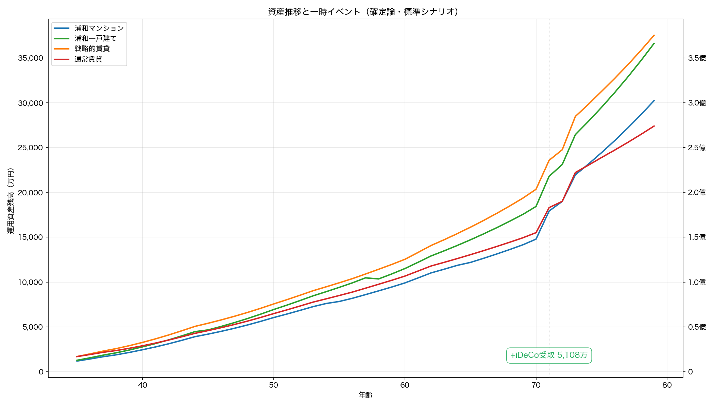
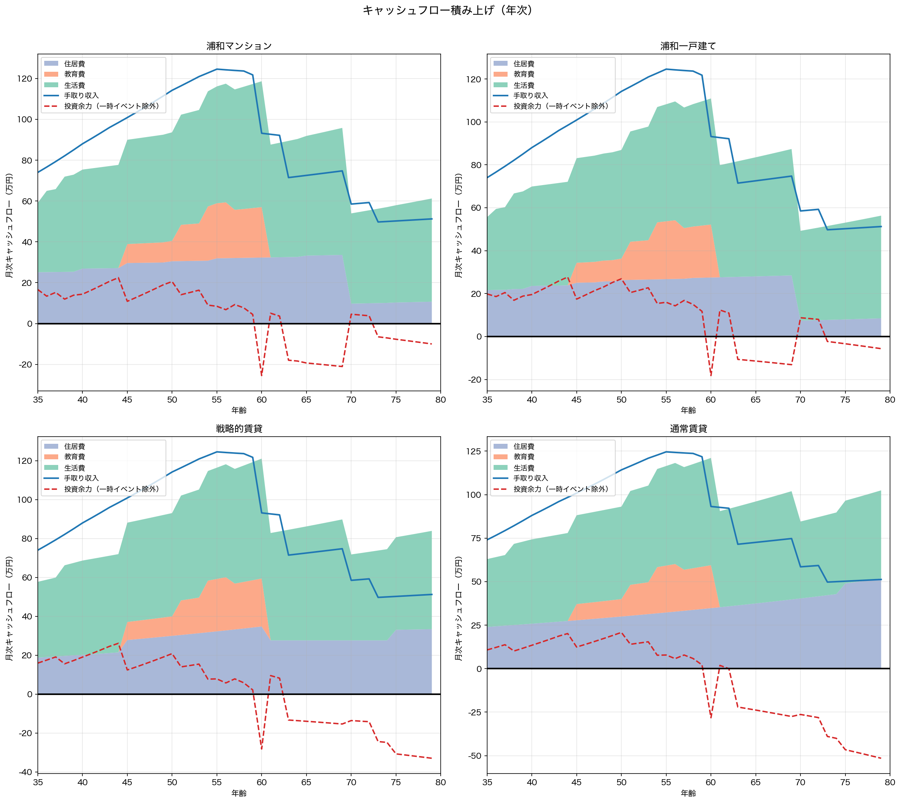
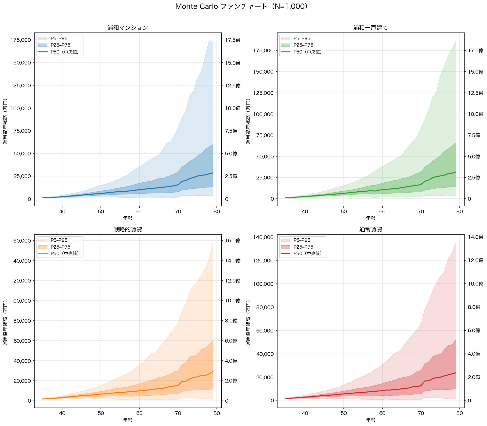

## 35歳始動・80歳完結：確率分布に基づく住宅戦略の45年間総合分析

---

## 第1章：前提条件

### 1.1 マクロ経済指標（5シナリオ）

日銀の2%物価目標が長期定着する想定のもと、**5シナリオ**を確定論ベースラインとし、標準シナリオ中心にモンテカルロ確率分析（N=1,000）で市場変動リスクを定量化する。

| パラメータ | 低成長 | 標準 | 高成長 | 慢性スタグフレーション | サイクル型(*) |
|----------|--------|------|--------|------------------|-----------|
| インフレ率 | 1.0% | **2.0%** | 3.0% | 2.0% | 2.3% |
| 賃金上昇率 | 1.0% | **2.0%** | 3.0% | 1.5% | 1.7% |
| 運用利回り | 5.0% | **6.0%** | 7.5% | 4.5% | 5.1% |
| 土地上昇率 | 0.0% | **0.8%** | 1.5% | 0.0% | 0.2% |
| 実質賃金 | ±0% | **±0%** | ±0% | **-0.5%** | **-0.6%** |
| 住宅ローン金利 | 0.50%→1.25% | **0.75%→2.50%** | 1.25%→3.50% | 0.75%→2.25% | 0.90%→2.75% |

(*) **サイクル型**は10年周期（7年通常＋3年スタグフレーション）で全パラメータが年次変動する。通常期は投資リターン6.0%・インフレ2.0%・賃金2.0%・土地0.75%、スタグフレーション期は投資リターン3.0%・インフレ3.0%・賃金1.0%・土地-1.0%。表中の値は加重平均。 45年間で4.5サイクルを経験。

**標準シナリオの根拠：** インフレ2.0%（日銀目標、CPI定着）、賃金2.0%（**実質横ばい**、キャリアカーブとは別の底上げ）、ローン0.75%→2.50%（5年ステップ）、運用6.0%（全世界株式の長期名目期待リターン上位、実質4.0%）、土地0.75%（実需エリアの緩やかな上昇）。

**慢性スタグフレーション：** インフレ2.0%に対し賃金1.5%で**実質賃金が毎年-0.5%低下**（45年で購買力80%）。運用4.5%、ローン0.75%→2.25%。

**サイクル型：** 好況と不況が10年周期で交互に訪れる現実的な経済変動モデル。スタグフレーション期には投資リターンが半減（6%→3%）し、インフレが加速（2%→3%）する一方で賃金は半減（2%→1%）。

### 1.2 世帯プロファイル

**世帯条件：** 夫35歳・妻32歳の共働き、貯蓄1,200万円、手取り月74万円（夫44万＋妻30万）、子1人（妻35歳出産、**学部卒・22歳独立**）。生活費上乗せ月3万円。教育方針は中学から私立・理系。特別支出として飛鳥日本一周（71歳・500万円）を計上。車所有。

**所得の推移：**

5段階キャリアカーブ（賃金構造基本統計調査ベース）×名目賃金上昇率（年2.0%）。

| 年齢 | 夫(万/月) | 妻(万/月) | 世帯合計 | 備考 |
|------|----------|----------|---------|------|
| 35歳 | 44.0 | 30.0 | 74.0 | 開始 |
| 40歳 | 53.6 | 36.6 | 91.7 |  |
| 45歳 | 62.2 | 43.7 | 106.9 |  |
| 50歳 | 72.2 | 50.7 | 123.9 |  |
| 55歳 | 79.7 | 57.7 | 138.4 | 夫ピーク近辺 |
| 60歳 | 45.4 | 59.9 | 105.3 | 再雇用期 |
| 65歳 | 47.7 | 35.6 | 83.3 | 再雇用期 |
| 70歳 | 26.5 | 37.4 | 63.9 | 年金期 |
| 75歳 | 27.8 | 24.9 | 52.8 | 年金期 |
| 79歳 | 29.0 | 25.9 | 54.9 | 年金期 |

妻が3歳若いため、**夫60歳の再雇用後も妻の現役収入が3年間残る**。

**教育費：**

子1人・中学から私立・理系・学部。

**特別支出：**

| 年齢 | 内容 | 基準値 | インフレ調整後（名目） |
|------|------|--------|-------------------|
| 71歳 | 飛鳥日本一周 | 500万円 | 約1,020万円 |

### 1.3 生活防衛資金

**生活費6ヶ月分を現金確保。** 35歳時点で約192万円（初期資産の約16%）。世帯構成とインフレに連動。

### 1.4 iDeCo（個人型確定拠出年金）

夫婦各月2万円（計4万）を60歳まで拠出（全額所得控除）。**71歳で一時金受取**（退職所得控除を別枠適用）。夫は25年間（600万円）、妻は28年間（672万円）で**拠出累計1272万円**、税軽減累計約314万円、受取時退職所得税約476万円。

### 1.5 4戦略の定義と初期コスト

浦和常盤・北浦和エリアの中古物件（マンション7,580万・築10年、一戸建て6,547万・築7年）。**年収倍率7倍以内をクリアし、全戦略が35歳で即時スタート可能。**

| 項目 | **浦和マンション** | **浦和一戸建て** | **戦略的賃貸** | **通常賃貸** |
| :--- | :--- | :--- | :--- | :--- |
| 物件価格 | 7,580万円（築10年） | 6,547万円（築7年） | - | - |
| 住宅ローン（フルローン） | 7,580万円 | 6,547万円 | - | - |
| 諸費用（物件価格の8%） | **606万円** | **524万円** | **105万円**（敷金等） | **105万円**（敷金等） |
| 生活防衛資金 | **192万円** | **192万円** | **192万円** | **192万円** |
| **35歳時の運用開始元本** | **402万円** | **484万円** | **903万円** | **903万円** |

---

## 第2章：戦略の仕組み

### 2.1 浦和マンション：駅近の利便性と高齢期のQOL

7,580万円（築10年、駅徒歩5-8分）。一戸建てとの価格差1,033万に加え、管理費・修繕積立金の段階増額で総コスト差はさらに拡大。

**月次コスト構造（管理費＋修繕積立金＋税＋保険）：**

| 築年数 | 管理費 | 修繕積立金 | 固定資産税 | 保険 | **月額合計** |
| :--- | :--- | :--- | :--- | :--- | :--- |
| 築10年（購入時） | 1.55万 | 1.1万（×1.0） | 1.8万 | 0.15万 | **4.6万** |
| 築30年 | 1.55万 | 2.2万（×2.0） | 1.8万 | 0.15万 | **5.7万** |
| 築50年超 | 1.55万 | 4.0万（×3.6） | 1.8万 | 0.15万 | **7.5万** |

※管理費等にインフレ2.0%累積。修繕積立金は長期修繕計画の名目値（追加調整なし）。

**高齢期のQOL：** ワンフロア・オートロック・共用部管理が利点。ただし80歳時点で築55年、建替え問題が顕在化。

### 2.2 浦和一戸建て：支出固定化と実物資産の保持

完済後（70歳）の月次コスト4.4万/月はマンションより低い。

| 築年数 | 小修繕 | 固定資産税 | 保険 | その他(※) | **月額合計** |
| :--- | :--- | :--- | :--- | :--- | :--- |
| 築7-10年（購入時） | 1.0万 | 1.8万 | 0.4万 | 0.7万 | **3.9万** |
| 築20年 | 1.3万 | 1.8万 | 0.4万 | 0.7万 | **4.2万** |
| 築30年 | 1.6万 | 1.8万 | 0.4万 | 0.7万 | **4.5万** |
| 築40年超 | 1.8万 | 1.8万 | 0.4万 | 0.7万 | **4.7万** |
| 完済後 | 1.5万 | 1.8万 | 0.4万 | 0.7万 | **4.4万** |

※その他：セキュリティ0.5万＋雑費0.2万。全額インフレ2.0%累積。

80歳時点で**築52年**。水道光熱費は月0.3万追加（インフレ連動）。

### 2.3 戦略的賃貸：ノマド・ダウンサイジング

- **Phase I：2LDK（家賃18万）** — 35〜44歳。
- **Phase II：3LDK（23万）** — 45〜60歳。教育費との二重負担が**15年間**。
- **Phase III：2LDK** — 61〜80歳。入居時の名目家賃で固定。

**75歳以降の入居審査リスク：** 確率加重プレミアム月3万円（インフレ連動）。

**通常賃貸（3LDK固定）：** 全期間3LDK（月23万）。家賃はインフレ上昇し続ける。

### 2.4 ペアローン必須の構造的制約

- **離婚リスク：** 共有名義で財産分与が複雑（賃貸は契約解除のみ）
- **片働きリスク：** 片方の収入停止で住宅費を単独負担→破綻リスク
- **団信：** 片方死亡でその債務のみ免除、もう片方は残存

---

## 第3章：確定論ベースライン — 「計画通りの場合」

**年利6.0%が45年間一定の上限推計。** 確率分析は第4章。

### 3.1 5シナリオ×4戦略の最終結果

| シナリオ | マンション | 一戸建て | 戦略的賃貸 | 通常賃貸 |
|----------|----------|---------|------|------------|
| **低成長** | 2.63億 | **3.62億** | 3.05億 | 2.25億 |
| **標準** | 3.92億 | **5.32億** | 4.46億 | 3.11億 |
| **高成長** | 6.81億 | **9.20億** | 8.15億 | 5.63億 |
| **慢性スタグフレーション** | 1.06億 | **2.03億** | 1.19億 | 0.20億 |
| **サイクル型** | 1.47億 | **2.66億** | 1.75億 | 0.49億 |

※80歳時点の税引後名目値。インフレ45年で貨幣価値は約41%に縮小（標準・浦和一戸建て5.32億→**実質約2.18億**）。

### 3.2 資産推移とキャッシュフロー構造

**チャートの読み方：** 上段=4戦略の資産推移（赤▲=一時支出、緑+=iDeCo受取）。下段=個別キャッシュフロー（積み上げ=支出内訳、青線=収入、赤破線=投資余力）。

**主要転換点：**

- **蓄積期（35〜44歳）：** 教育費前の投資蓄積期。
- **教育費期（〜60歳）：** 子1人の教育費が発生。
- **特別支出（71歳）：** 飛鳥日本一周500万円（名目約1,020万円）。
- **段階的再雇用（夫60歳・妻63歳）：** 3歳差が収入急減を2段階に分散。
- **ローン完済（70歳）：** 住居費が激減。残り10年で序列確定。
- **年金期（70〜80歳）：** 75歳以降、賃貸に高齢者プレミアム月3万が加算。

### 3.3 標準シナリオの詳細内訳

| 項目 | **浦和マンション** | **浦和一戸建て** | **戦略的賃貸** |
| :--- | :--- | :--- | :--- |
| **運用資産残高(80歳)** | 37,148万円 | 51,446万円 | 45,269万円 |
| **不動産土地価値(名目)** | 2,652万円 | 5,040万円 | 0 |
| **不動産換金コスト** | -200万円 | -650万円 | 0 |
| **流動性ディスカウント** | 0 | -756万円 | 0 |
| **最終純資産（税引前）** | **39,600万円（3.96億円）** | **55,080万円（5.51億円）** | **45,269万円（4.53億円）** |
| **金融所得税** | -404万円 | -1,891万円 | -696万円 |
| **税引後手取り純資産** | **39,196万円（3.92億円）** | **53,189万円（5.32億円）** | **44,573万円（4.46億円）** |

**通常賃貸：** 運用資産31,087万円、金融所得税▲0万円、税引後31,087万円（3.11億円）。

**NISA・特定口座の内訳：**

| 戦略 | NISA残高（元本） | 特定口座残高（元本） | 金融所得税 |
|------|-----------------|------------------|----------|
| 浦和マンション | 31,900万円（元本3,600万円） | 4,971万円（元本2,982万円） | 404万円 |
| 浦和一戸建て | 35,853万円（元本3,600万円） | 15,315万円（元本6,007万円） | 1,891万円 |
| 戦略的賃貸 | 38,334万円（元本3,600万円） | 6,658万円（元本3,230万円） | 696万円 |
| 通常賃貸 | 30,810万円（元本3,403万円） | 0万円（元本0万円） | 0万円 |

### 3.4 感度分析：投資規律（ライフスタイル・クリープ）

100%投資は非現実的。ローンの「強制貯蓄」効果の有無で規律が分かれる。

- **購入派：余剰資金の90%を投資**（ローンの強制貯蓄効果）
- **賃貸派：余剰資金の80%を投資**（クリープ発生しやすい）

| シナリオ | マンション | 一戸建て | 戦略的賃貸 | 通常賃貸 |
|----------|----------|---------|------|------|
| **低成長** | 2.31億(▲0.32) | 3.24億(▲0.38) | 2.41億(▲0.64) | 1.68億(▲0.57) |
| **標準** | 3.45億(▲0.47) | 4.76億(▲0.56) | 3.48億(▲0.97) | 2.23億(▲0.88) |
| **高成長** | 6.00億(▲0.81) | 8.21億(▲0.99) | 6.40億(▲1.75) | 4.04億(▲1.59) |
| **慢性スタグフレーション** | 0.85億(▲0.21) | 1.74億(▲0.29) | 0.73億(▲0.46) | ⚠77歳破綻 |
| **サイクル型** | 1.19億(▲0.28) | 2.28億(▲0.38) | 1.14億(▲0.61) | ⚠79歳破綻 |

---

## 第4章：Monte Carlo 確率分析 — 市場変動の現実

1,000回試行のモンテカルロで**確率分布と破綻リスク**を定量化。

### 4.1 シミュレーション条件

| 変動要因 | 分布 | サンプリング | パラメータ |
|---------|------|------------|----------|
| 投資リターン | 対数正規分布 | **年次**（sequence risk 捕捉） | 期待値6.0%、標準偏差15% |
| インフレ率 | 正規分布 | ラン単位 | 平均2.0%、標準偏差0.5% |
| 賃金上昇率 | 正規分布 | ラン単位 | 平均2.0%、標準偏差0.5%、インフレとの相関0.8 |
| 土地上昇率 | 正規分布 | ラン単位 | 平均0.75%、標準偏差3% |
| インフレ-土地相関 | コレスキー分解 | ラン単位 | 相関係数0.6 |

**生活イベントリスク：**

| イベント | 確率 | 影響 | 適用対象 |
|---------|------|------|---------|
| 失業 | 年2%（最大2回） | 6ヶ月間収入ゼロ | 全戦略（60歳未満） |
| 災害 | 年0.5% | 物件価値30%毀損（保険50%カバー） | 購入派のみ |
| 介護 | 75歳以降年5% | 月15万円追加 | 全戦略 |
| 入居拒否 | 70歳以降年10% | 月5万円プレミアム | 賃貸のみ |
| 離婚 | 年1% | 資産50%分割＋物件売却＋2LDK賃貸化 | 全戦略 |
| 配偶者死亡 | 年0.1% | 団信消滅＋保険金3,000万＋遺族年金 | 全戦略 |

### 4.2 80歳時点の税引後手取り資産分布

| 戦略 | P5(悲観) | P25 | P50(中央値) | P75 | P95(楽観) | 破綻確率 |
|------|---------|-----|------------|-----|---------|---------|
| 浦和マンション | 0.00億 | 0.59億 | **2.81億** | 6.46億 | 16.73億 | 19.9% |
| 浦和一戸建て | 0.00億 | 0.86億 | **3.70億** | 8.26億 | 20.90億 | 19.7% |
| 戦略的賃貸 | 0.00億 | 0.22億 | **2.24億** | 5.64億 | 16.66億 | 22.6% |
| 通常賃貸 | 0.00億 | 0.00億 | **1.25億** | 4.03億 | 12.96億 | 32.5% |

| 戦略 | 平均 | 標準偏差 |
|------|------|---------|
| 浦和マンション | 4.92億 | 6.71億 |
| 浦和一戸建て | 6.16億 | 8.15億 |
| 戦略的賃貸 | 4.58億 | 7.20億 |
| 通常賃貸 | 3.31億 | 5.90億 |

### 4.3 確定論との乖離分析

| 戦略 | 確定論(6.0%固定) | MC P50 | 乖離率 |
|------|-----------------|--------|-------|
| 浦和マンション | 3.92億 | **2.81億** | **▲28%** |
| 浦和一戸建て | 5.32億 | **3.70億** | **▲31%** |
| 戦略的賃貸 | 4.46億 | **2.24億** | **▲50%** |
| 通常賃貸 | 3.11億 | **1.25億** | **▲60%** |

### 4.4 ストレステスト：イベントリスクの影響

| イベント | 浦和マンション | 浦和一戸建て | 戦略的賃貸 | 通常賃貸 |
|---------|-------------|------------|----------|--------|
| ベース(イベントなし) | 2.4% | 0.3% | 2.8% | 11.5% |
| 失業6ヶ月(年2%) | 5.1% | 1.0% | 2.8% | 11.5% |
| 離婚(年1%) | 12.2% | 11.3% | 19.1% | 26.4% |
| 全イベント | 19.9% | 19.7% | 22.6% | 32.5% |

---

## 第5章：数値に現れない各戦略の特性

**購入派：** 居住安定性（更新拒否・値上げなし）、自由な改修、完済後の低コスト。子1人の教育費期間中も住居費が固定されるため、見通しが立ちやすい。

**賃貸派：** 環境変更の柔軟性（転居容易）、災害・地域衰退リスクからの移動性、住環境の更新。ダウンサイズで再雇用開始後に支出を正常化可能。

**共通：** 維持管理の時間コスト（45年間で一戸建て約1440h、マンション約765h、賃貸約495h）。

---

## 第6章：出口戦略 — 「80歳で老人ホーム」の前提

### 6.1 物理的・身体的限界

80歳時点で一戸建て築52年、マンション築55年。階段転倒・ヒートショック（戸建て）、老朽化（マンション）が課題。

### 6.2 子供に対する負担の排除

自宅居住継続は「介護」「家財整理・解体・売却」の負担を子供に転嫁するリスク。

### 6.3 各戦略の出口手続きと税務

- **購入派：** 不動産売却＋証券で入居。3,000万特別控除で譲渡税ゼロ
- **賃貸派：** 証券のみで入居。不動産処分不要でシンプル

### 6.4 入居可能な施設グレード

80歳時点の税引後純資産から、夫婦で入居できる有料老人ホームの水準を試算する。

**前提条件：**
- 80歳で夫婦2人入居（2LDK・約65〜75㎡）、110歳まで生存（30年間・長生きリスク対応）
- 入居審査ベース：運用利回り0%（施設側はキャッシュカバレッジで審査、暴落リスク考慮）
- 基本月額（管理費・サービス費）は30年間定額、追加実費は年齢逓減（80代100%→90代60%→100代30%）
- 施設費用・残存資産とも2026年価値ベース（インフレ相殺済み）

| グレード | 入居一時金 | 基本月額 | 追加実費(80代) | 必要資産 | 実例施設 |
|---------|-----------|---------|--------------|---------|---------|
| S（超高級） | 2億円 | 50万円 | 40万円 | **4.71億円** | パークウェルステイト西麻布 |
| A（高級） | 1.5億円 | 30万円 | 30万円 | **3.26億円** | サクラビア成城、サンシティ銀座EAST |
| B（準高級） | 7,000万円 | 35万円 | 15万円 | **2.30億円** | グランクレール成城、トラストガーデン用賀の杜 |
| C（標準） | 1,000万円 | 20万円 | 10万円 | **1.05億円** | 介護付き有料老人ホーム |

シミュレーション出力は80歳時点の名目値。2.0%インフレ×45年で割り引き、2026年実質値に変換（係数0.41）。

| 戦略 | 確定論（実質） | グレード | MC P50（実質） | グレード | MC P25（実質） | グレード |
|------|-------------|---------|-------------|---------|-------------|---------|
| 浦和マンション | 1.61億 | **C** | 1.15億 | C | 0.24億 | - |
| 浦和一戸建て | 2.18億 | **C** | 1.52億 | C | 0.35億 | - |
| 戦略的賃貸 | 1.83億 | **C** | 0.92億 | - | 0.09億 | - |
| 通常賃貸 | 1.28億 | **C** | 0.51億 | - | 0.00億 | - |

---

## 第7章：結論

### 7.1 総合比較表

| 評価軸 | 一戸建て | マンション | 戦略的賃貸 | 通常賃貸 |
|--------|---------|-----------|-----------|---------|
| **確定論・標準シナリオ** | **5.32億** | 3.92億 | 4.46億 | 3.11億 |
| **確定論・投資規律込み** | **4.76億** | 3.45億 | 3.48億 | 2.23億 |
| **MC・P50（中央値）** | **3.70億** | 2.81億 | 2.24億 | 1.25億 |
| **MC・P5（悲観）** | 0.00億 | 0.00億 | 0.00億 | 0.00億 |
| **MC・破綻確率** | **19.7%** | 19.9% | 22.6% | 32.5% |
| 確定論・低成長 | ✅（3.62億） | ✅（2.63億） | ✅（3.05億） | ✅（2.25億） |
| 確定論・高成長 | ✅（9.20億） | ✅（6.81億） | ✅（8.15億） | ✅（5.63億） |
| 確定論・慢性スタグフレーション | ✅（2.03億） | ✅（1.06億） | ✅（1.19億） | ✅（0.20億） |
| 確定論・サイクル型 | ✅（2.66億） | ✅（1.47億） | ✅（1.75億） | ✅（0.49億） |

### 7.2 構造的結論

**浦和一戸建てが圧倒的に有利**（最大2.2億・42%差）。戦略選択が資産形成の成否を左右する。

**浦和一戸建てがリターン・安全性の両面で優位。**MC中央値3.70億、破綻確率19.7%。

**⚠ 最善の浦和一戸建てでも破綻確率19.7%。**不況期の投資リターン低迷やイベントリスク（失業・離婚）が重なると資産枯渇する可能性がある。**初期資産の積み増し・支出削減・購入時期の先送り**など前提条件の見直しを検討すべき。

**あなたの設定に基づく定性評価：**

- **車所有** → 一戸建ては自前駐車場で月約2万の維持費節約。マンション・賃貸は駐車場代が上乗せされ、長期で大きな差になる。
- **子1人** → 教育費の重複がなく、どの戦略でも家計の圧迫は限定的。賃貸の柔軟性（転居・ダウンサイズ）が活きる場面が多い。

**投資規律の影響：** 戦略的賃貸は規律低下で1.0億の減少（全戦略中最大）。賃貸はローンの「強制貯蓄」がないため、支出管理の自己規律が試される。

**年齢差3歳：** 収入急減を2段階に分散し、全戦略の安定性に寄与。

### 7.3 リスク認識

**投資継続が最大の前提。** 貯金のみではインフレで実質購買力が約41%に縮小。

**生活コスト管理が生死を分ける：** 日常の支出水準が最終資産に与える影響は住居選択以上に大きい。

**教育費リスク：** 教育費はインフレ調整前の基準値。子の進路変更は上振れ/下振れ要因。

**特別支出：** 合計500万円（2026年価値）が全戦略の資産を押し下げている。

**ペアローン：** 夫婦共働き継続が前提。離婚リスクはストレステスト定量化済み。